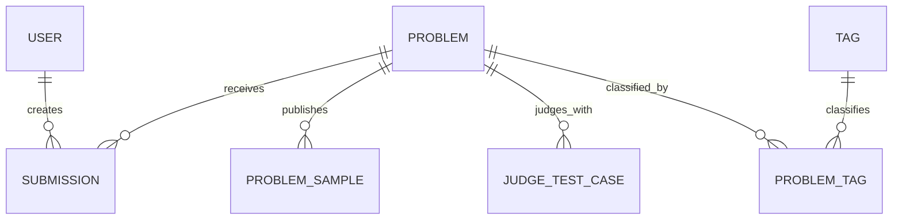
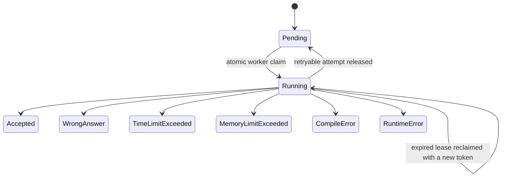

# Domain Model

## 1. Core entities

### User

Represents a regular platform account.

| Field | Notes |
|---|---|
| `id` | Immutable UUID primary key. |
| `username` | Unique display and login name. |
| `email` | Unique login/contact identifier. |
| `passwordHash` | Never exposed by any API. |
| `fullName` | Optional display name policy may be decided later. |
| `createdAt` | UTC timestamp. |

There is no `Role` field in the MVP domain.

### Problem

Represents a curated programming exercise.

| Field | Notes |
|---|---|
| `id` | Internal numeric or UUID identifier. |
| `slug` | Unique, stable URL identifier, for example `two-sum`. |
| `title` | User-facing title. |
| `statementMarkdown` | Problem description rendered safely by the client. |
| `constraintsMarkdown` | Input and output constraints. |
| `difficulty` | `Easy`, `Medium`, or `Hard`. |
| `timeLimitMs` | Runtime limit used by the judge. |
| `memoryLimitKb` | Memory limit used by the judge. |
| `executionMode` | `StdinStdout` or `Function`; legacy packages default to `StdinStdout`. |
| `functionSignatureJson` | Internal validated signature for Function problems; otherwise null. |
| `functionAdapterTemplate` | Private C++17 harness template for Function problems; otherwise null and never public. |
| `status` | `Draft`, `Published`, or `Archived`. |
| `judgeVersion` | Positive version of the current private judge data. |
| `publishedAt` | UTC timestamp when applicable. |
| `createdAt`, `updatedAt` | UTC audit timestamps. |

`Score` and `CreatedBy` are intentionally excluded from the public product
model. Content provenance, if needed, belongs to internal operations metadata.

### ProblemSample

Represents an input/output example that is intentionally public.

| Field | Notes |
|---|---|
| `id` | Internal identifier. |
| `problemId` | Parent problem. |
| `input` | Example standard input returned by the public API. |
| `expectedOutput` | Example standard output returned by the public API. |
| `explanation` | Optional explanation displayed with the sample. |
| `ordinal` | Positive, stable display order within a problem. |

### JudgeTestCase

Represents judge-only input and expected output.

| Field | Notes |
|---|---|
| `id` | Internal identifier; never returned to a normal user. |
| `problemId` | Parent problem. |
| `input` | Exact stdin content. |
| `expectedOutput` | Canonical expected stdout. |
| `ordinal` | Stable execution order. |
| `systemTestSuiteVersion` | Positive version selecting the immutable published suite. |

Public samples and judge test cases use separate entities and tables. This is a
deliberate confidentiality boundary: a public catalogue query never needs to
load `JudgeTestCase`. All judge test data must be treated as confidential.

### Submission

Represents one immutable code attempt.

| Field | Notes |
|---|---|
| `id` | UUID primary key. |
| `userId` | The owner. |
| `problemId` | The submitted problem. |
| `systemTestSuiteVersion` | Immutable published judge version captured when the submission is created. |
| `language` | MVP allows only `cpp17`. |
| `sourceCode` | Immutable submitted source. |
| `status` | Lifecycle state described below. |
| `executionTimeMs` | Max observed testcase execution time, if known. |
| `memoryUsedKb` | Max observed testcase memory use, if known. |
| `compileMessage` | Sanitized and size-limited; visible only to owner. |
| `createdAt`, `startedAt`, `finishedAt` | UTC lifecycle timestamps. |
| `attemptCount` | Operational retry count, not user-visible scoring. |
| `workerId` | Internal identity of the worker holding the current claim. |
| `claimToken` | Internal fencing token that changes on every claim. |
| `leaseExpiresAt` | UTC expiry of the current claim. |

The claim fields are operational metadata. They are not part of public API
responses and are cleared whenever a submission leaves `Running`.

### Tag

Represents a reusable classification such as `array`, `dynamic-programming`, or
`binary-search`. A tag has a unique slug and display name.

## 2. Submission state machine

Final states are immutable. A worker crash before a final state is handled by a
lease/timeout recovery policy. An expired claim is transferred with a new
fencing token, while an explicitly abandoned retryable attempt returns to
`Pending`. Exhausted attempts end as an operational failure.

## 3. Domain invariants

- Only a Published problem accepts new submissions.
- A submission belongs to exactly one user and one problem.
- A user can only read their own submission source and diagnostics.
- `Accepted` means every testcase passed under the configured limits.
- A submission is judged only against the system-suite version captured when it
  was created; retries never switch versions.
- A problem cannot be Published without valid samples and at least one hidden
  testcase.
- A Function problem cannot be Published without a valid signature, adapter,
  and JSON sample/test data matching the signature.
- A StdinStdout problem cannot retain function configuration.
- Hidden testcase content is never part of public DTOs or logs.
- Solved status is derived from submissions, not stored as an editable flag.
