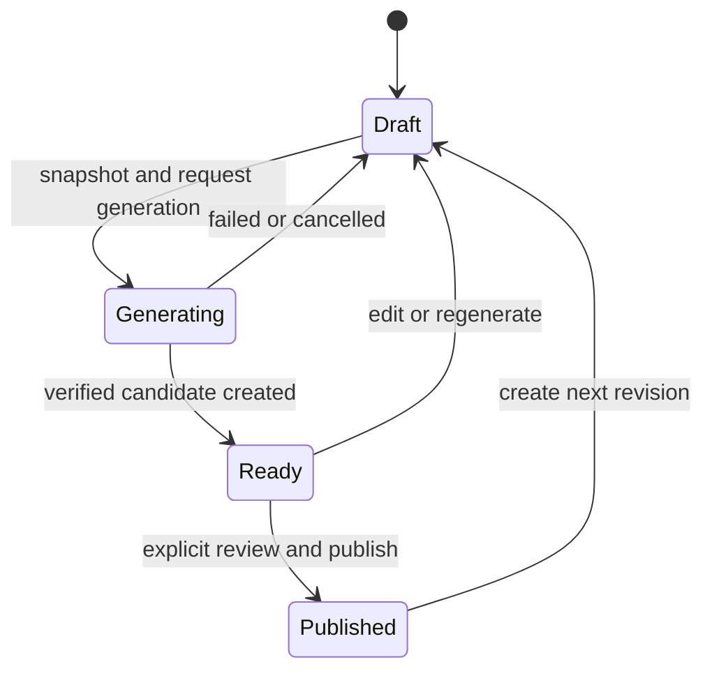

# Problem Authoring Contract

This document defines the approved target contract for internal problem
authoring. The generator SDK and transitional ContentTool workflow implement
version 1. Persistence, the content-generation worker, and maintainer UI remain
later branches.

Problem authoring remains an internal maintainer operation. It does not create
a public author role or a public testcase-authoring API.

## 1. Authoring model

Each editable revision owns one `ProblemAuthoringDefinition`. A definition is
the complete, reviewable source needed to produce a system-test-suite
candidate. It is not itself a published suite and is never read while judging
a learner submission.

```text
ProblemAuthoringDefinition
|-- schemaVersion
|-- executionMode
|-- functionSignature
|-- handwrittenCases
|-- generator
|-- inputValidator
|-- referenceSolution
`-- wrongSolutions
```

The first implementation supports `cpp17` Function problems only. Existing
stdin/stdout packages remain supported through the compatibility path. Adding
stdin/stdout authoring or another learner language requires a later contract
decision.

### Definition fields

| Field | Required | Contract |
|---|---|---|
| `schemaVersion` | Yes | Positive version of this definition format. Version 1 is defined here. |
| `executionMode` | Yes | `Function` in version 1. It is explicit and cannot be inferred from source. |
| `functionSignature` | Yes | Language-neutral class, method, return type, and ordered parameters. |
| `handwrittenCases` | Yes | Ordered, uniquely named argument values used for corner and regression cases. At least one is required. |
| `generator` | Yes | C# source using the pinned Problem Generator SDK, plus its SDK version. |
| `inputValidator` | Yes | C# validation source using the same SDK contract. Every generated or handwritten input must pass it. |
| `referenceSolution` | Yes | C++17 class/method source matching `functionSignature`; no `main` or I/O adapter. |
| `wrongSolutions` | No | Named C++17 class/method sources used only for differential quality checks. |

Problem statement, constraints, samples, tags, difficulty, and resource limits
remain problem metadata. They are edited with the same draft revision but are
not executable source fields in `ProblemAuthoringDefinition`.

The version-1 serialized shape is:

```json
{
  "schemaVersion": 1,
  "executionMode": "Function",
  "functionSignature": {
    "className": "Solution",
    "methodName": "findMaximum",
    "returnType": "Int32",
    "parameters": [
      { "name": "nums", "type": "Int32Array" }
    ]
  },
  "handwrittenCases": [
    {
      "name": "all-negative",
      "group": "handwritten",
      "arguments": { "nums": [-9, -3, -7] }
    }
  ],
  "generator": {
    "language": "csharp",
    "sdkVersion": 1,
    "source": "public sealed class MaxArrayGenerator : ProblemGenerator { ... }"
  },
  "inputValidator": {
    "language": "csharp",
    "sdkVersion": 1,
    "source": "public sealed class MaxArrayValidator : InputValidator { ... }"
  },
  "referenceSolution": {
    "language": "cpp17",
    "source": "class Solution { public: int findMaximum(vector<int>& nums) { ... } };"
  },
  "wrongSolutions": [
    {
      "name": "returns-first-element",
      "language": "cpp17",
      "source": "class Solution { public: int findMaximum(vector<int>& nums) { ... } };"
    }
  ]
}
```

Unknown or duplicate properties are rejected. Names are unique within their
collection. `arguments` uses the same exact-key JSON rules as Function package
inputs. Source text is UTF-8, required where shown, and independently bounded
by platform configuration. `language` and `sdkVersion` are explicit so a
snapshot never changes meaning when defaults are upgraded.

An editor preset produces ordinary editable generator source. Preset identity
is UI provenance only and never changes generation semantics.

## 2. Function signature

Version 1 reuses the language-neutral signature shape and value-type whitelist
from package schema version 2:

```json
{
  "className": "Solution",
  "methodName": "findMaximum",
  "returnType": "Int32",
  "parameters": [
    { "name": "nums", "type": "Int32Array" }
  ]
}
```

Supported values are `Int32`, `Int64`, `Double`, `Boolean`, `String`, and their
one-dimensional array forms. Names must be safe non-keyword C++ identifiers,
parameter names must be unique, and a method has at most 16 parameters.
Nested containers, nullable values, custom objects, mutation-only results, and
void returns are outside version 1.

The signature is the only source of truth for generated argument parsing,
method invocation, and result serialization. Maintainers do not provide an
adapter template.

## 3. Generator source

Generator source is problem-specific C# code compiled against a versioned SDK.
It declares cases through `ProblemGenerator.Build(TestPlan)` and may contain
arbitrary problem logic within the sandbox limits. Helpers such as random
integers, arrays, permutations, trees, and graphs are convenience APIs, not a
closed strategy registry.

```csharp
public sealed class MaxArrayGenerator : ProblemGenerator
{
    public override void Build(TestPlan plan)
    {
        plan.Random("random", count: 500, context =>
        {
            var length = context.Int(1, 100_000);
            return Args(context.Arrays.Int32(length, -1_000_000_000, 1_000_000_000));
        });
    }
}
```

The SDK supplies deterministic random values from a platform-owned case seed.
Generator code must not select entropy from the clock, process, operating
system, network, or an undeclared file. The generation engine records the SDK
version, definition hash, group name, case ordinal, and derived seed for every
candidate.

Groups are named and ordered. Version 1 supports the semantic labels
`handwritten`, `edge`, `random`, `adversarial`, and `stress`; labels affect
reporting and review, not judge scoring or verdicts. The total count and all
serialized values remain subject to configured package and suite limits.

The version-1 SDK is the standalone `AlgoJudge.ProblemGeneratorSdk` assembly.
It provides:

- `ctx.Int`, `ctx.Long`, and `ctx.Boolean`;
- random, sorted, and all-equal integer arrays;
- bounded random strings and permutations; and
- tree, DAG, and connected-graph helpers.

Graph helpers return a vertex count and edge collection. Authors explicitly
transform that structure into the declared Function arguments, so helpers do
not expand the version-1 signature type whitelist.

## 4. Reference and wrong-solution sources

The reference solution is a C++17 class/method implementation matching the
declared signature. The platform generates the same generic harness used for a
learner Function submission, then compiles and runs it in the content sandbox
to create expected values.

Wrong solutions use the same source shape and harness. They are optional and
never become learner-visible content. A generated case may record which wrong
solutions it distinguishes. A wrong solution that survives does not silently
change expected output; generation reports the survivor for maintainer review.
The acceptance policy for suite quality is configured separately from verdict
semantics.

Source, diagnostics, generated arguments, and expected values are private
content. Normal logs contain identifiers, hashes, bounded counts, timings, and
safe error categories only.

## 5. Generation algorithm

For one immutable snapshot of a definition, the engine:

1. validates metadata, signature, source sizes, group names, and case limits;
2. compiles the generator and validator in the content-generation sandbox;
3. derives seeds and produces handwritten and generated arguments;
4. validates and canonically serializes every argument set;
5. generates and compiles the reference harness;
6. runs the reference once per argument set to produce expected output;
7. repeats generation and reference execution from the same snapshot and seeds
   and rejects any byte-level non-determinism;
8. optionally executes wrong solutions and records differential coverage; and
9. hashes all inputs, outputs, source identities, toolchain identities, seeds,
   ordering, and comparator configuration into an immutable suite candidate.

No database publication occurs unless all required steps succeed. Partial
outputs are disposable job artifacts and cannot be judged as a suite.

## 6. Revision and suite lifecycle



- `Draft` is mutable and cannot receive learner submissions.
- `Generating` is an immutable snapshot owned by one generation job. Edits
  create or update a Draft; they never alter the running snapshot.
- `Ready` has one verified immutable suite candidate and review statistics.
  Editing any generation input invalidates that candidate and returns the
  revision to Draft.
- `Published` atomically makes the candidate the problem's current positive
  system-suite version. Its content and provenance are immutable forever.

A generation failure is an attempt result, not a fifth lifecycle state. It
records bounded safe diagnostics and returns the revision to Draft. Publishing
a newer revision does not mutate older suites or submissions pinned to them.
Unpublishing controls catalogue visibility and does not delete suite versions.

## 7. Trust and sandbox boundary

Generator, validator, reference, and wrong-solution source are untrusted input
even though only maintainers may supply them. API and grading-worker processes
must never compile or execute authoring source.

A separately deployable content worker will claim generation jobs using the
same lease, retry, and fencing principles as other PostgreSQL queues. Its
orchestrator may access the sandbox runtime, but generated containers receive
no database credentials, signing keys, Docker socket, application source, or
host home directory.

Generator compilation/execution and C++17 compilation/execution use pinned
images and separate stages. Each stage has no network, a non-root user, dropped
capabilities, no new privileges, a read-only runtime filesystem, bounded
writable scratch space, and explicit CPU, wall-time, memory, PID, file, and
stdout/stderr limits. Source mounts are read-only. Only a bounded framed result
protocol crosses back to the content worker.

The CLI may orchestrate this same engine before the content worker and Admin
API exist. ContentTool does this for a private directory containing
`authoring.json`: `generate` compiles and runs source in the pinned .NET
generation image, while `validate-generated` repeats the complete pipeline and
compares provenance and files. It never falls back to executing generator
source in the ContentTool process.

Build the required image before using this workflow:

```powershell
./scripts/build-content-generator-image.ps1
./scripts/build-judge-image.ps1
```

The generated `.in`/`.out` pairs remain under `tests/`. Version-2 provenance is
written to `generator/generated-tests.json` and includes definition, source,
toolchain, case, output, and wrong-solution hashes. The package builder still
excludes `authoring.json`, source, and provenance from the private import ZIP.

## 8. Compatibility

- Package schema versions 1 and 2 remain valid import formats.
- Existing schema-version-2 Function packages keep their private adapter
  templates and continue to judge with them.
- Existing published suites and submissions pinned to them are unchanged.
- The current DLL/manifest authoring extension remains a legacy ContentTool
  input during migration, but it is not accepted by the future Admin API and
  receives no new capabilities.
- New authoring definitions never require a maintainer-authored project, DLL,
  manifest, `main`, parser, serializer, or adapter.
- Until persistence and an authoring package schema are implemented, a
  definition is an internal application contract, not a new ZIP member. A
  transition tool may materialize generated `.in`/`.out` pairs and a
  platform-generated private adapter into a schema-version-2 package.
- Removing either legacy package import or legacy adapter execution requires a
  separate migration decision and evidence that retained content has been
  converted.
